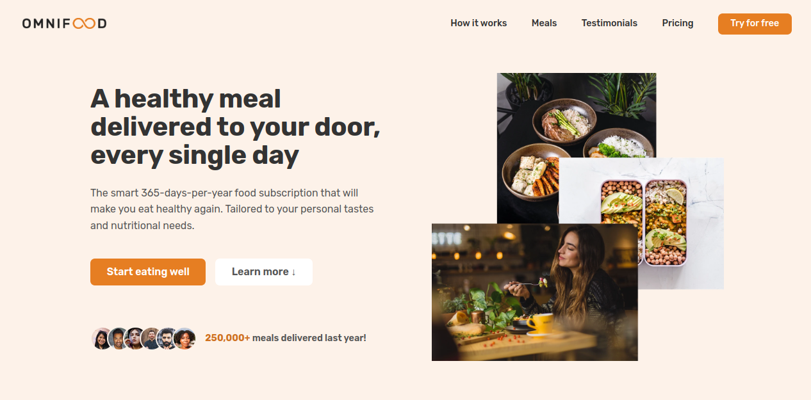
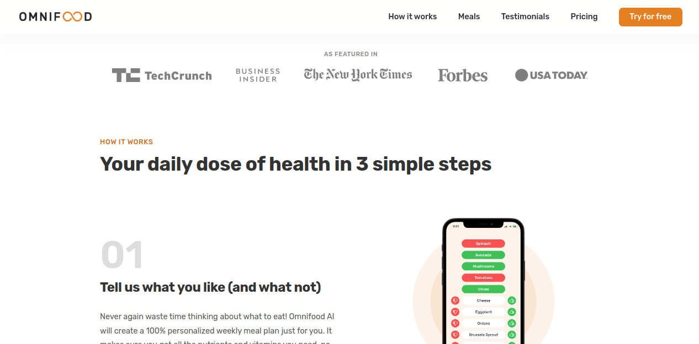
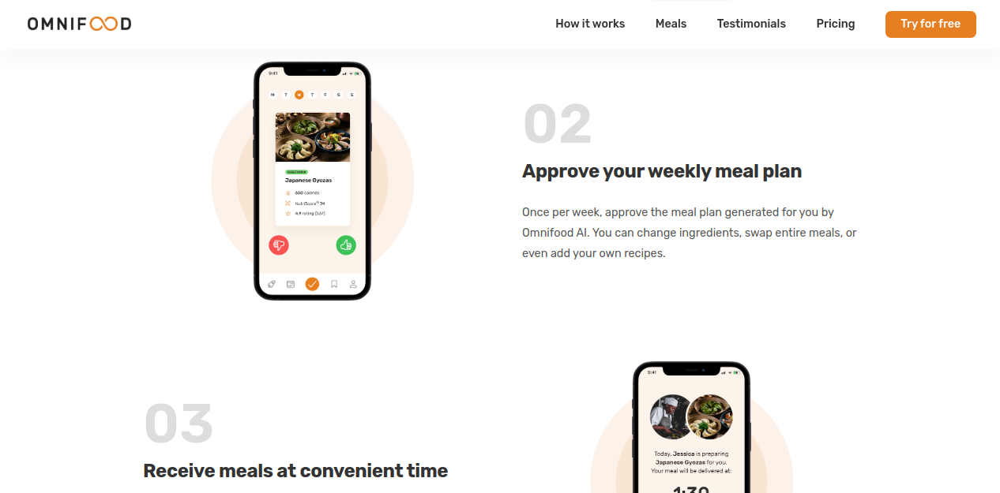
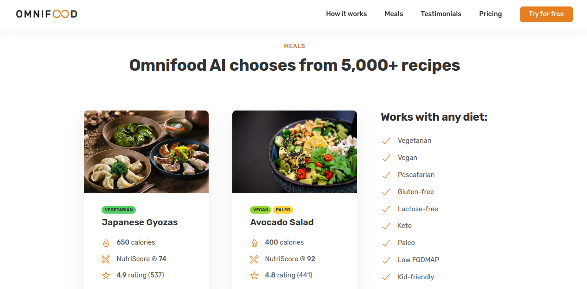
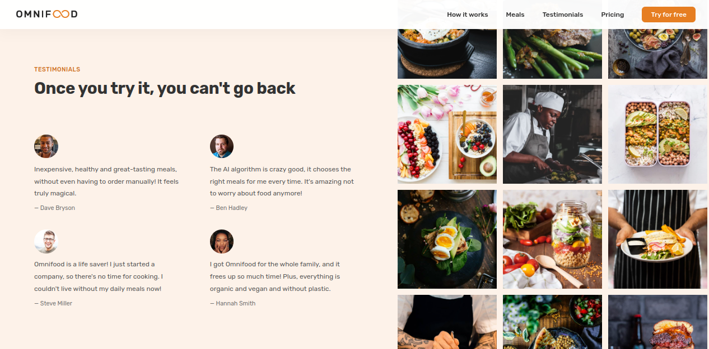
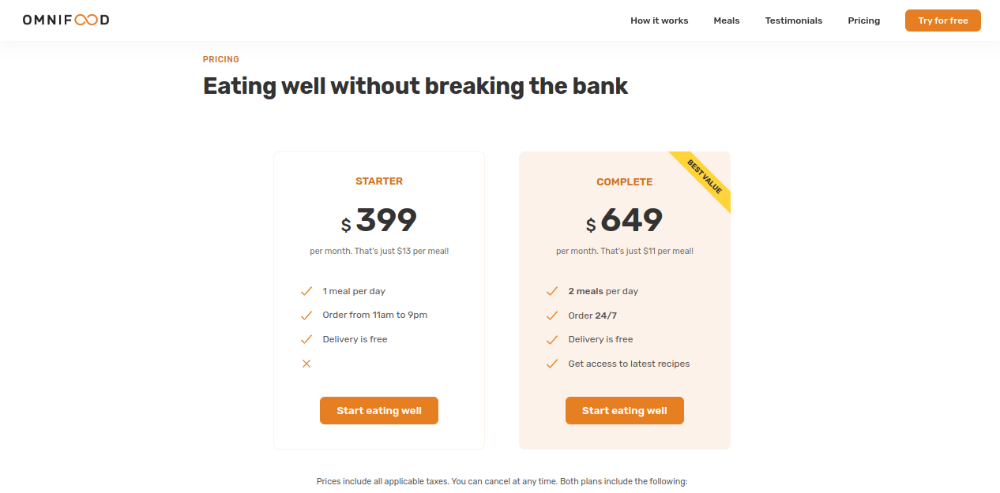
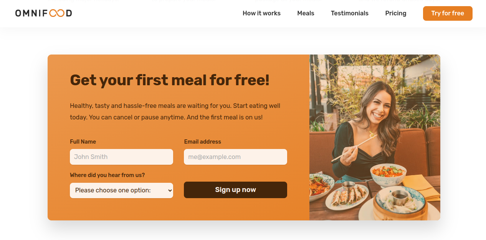
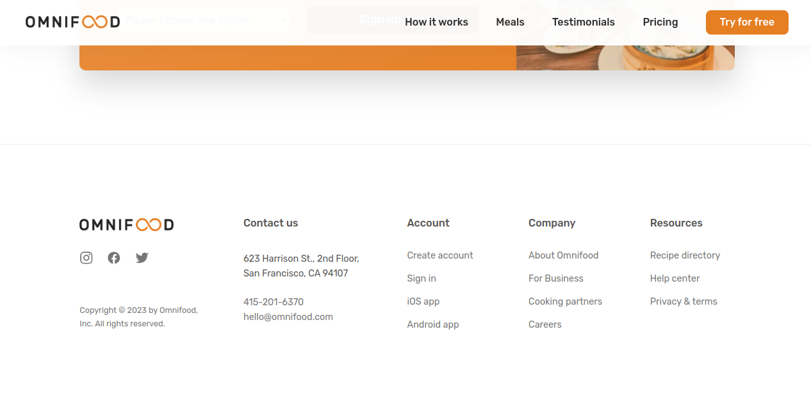

# Omnifooed Platform

Omnifooed is a web platform designed for selling and delivering a
variety of delicious meals. With over 250,000 meals delivered last
year, we are committed to providing a seamless and delightful
experience for both customers and vendors.

if you are looking for a project where you can learn basics of html,
css, js, media quries, website responsiveness and so much more then
this project is best option

##### I worked on this project for my fiver client. Please checkout my fiverr account if you want to hire me

- [Find me on fiver ](https://www.fiverr.com/zainbinramzan/develop-web-applications-with-mern-stack-react-node-express-moongodbplugin-react/README.md)
- [Find me on linkedin](https://www.linkedin.com/in/abu-zain-html-css-javascipt-developer/)

## Features

- Browse a diverse menu of tasty meals.
- Place orders easily through our user-friendly interface.
- Explore special offers and discounts.

## Technologies Used

- **HTML**: Used for structuring the content of the platform.
- **CSS**: Employed for styling and layout.
- **JavaScript**: Powering dynamic interactions and user interfaces.
